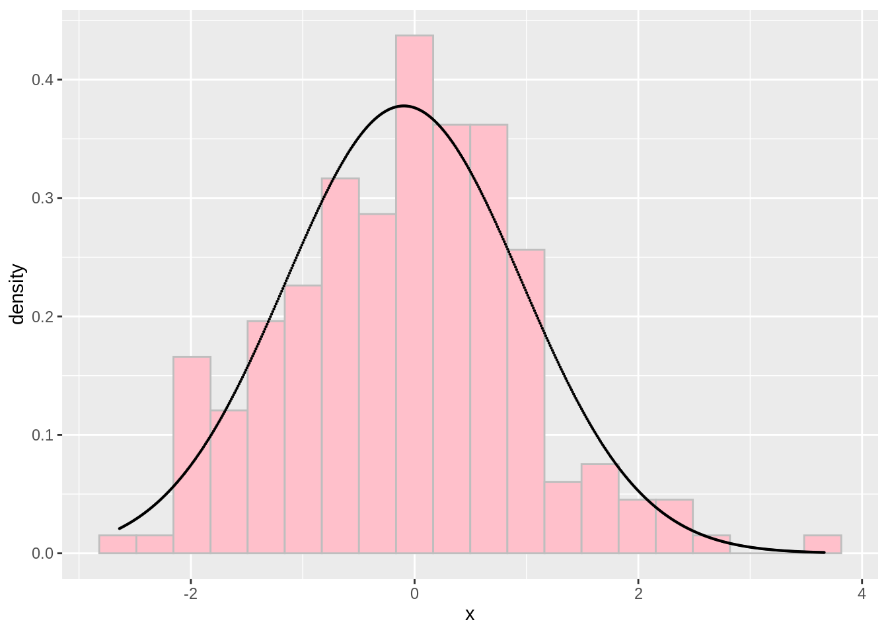
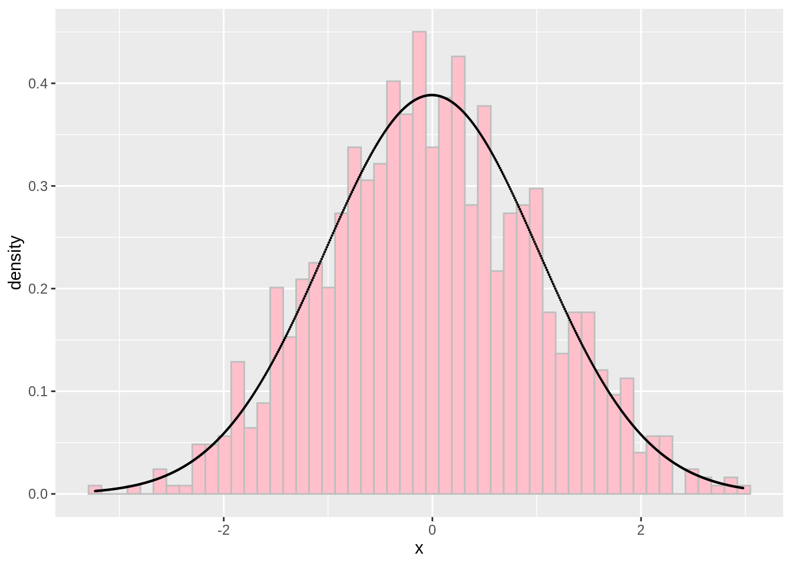
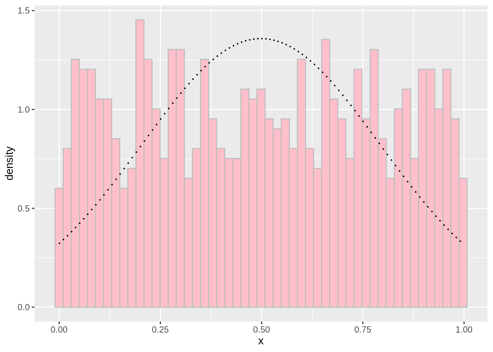
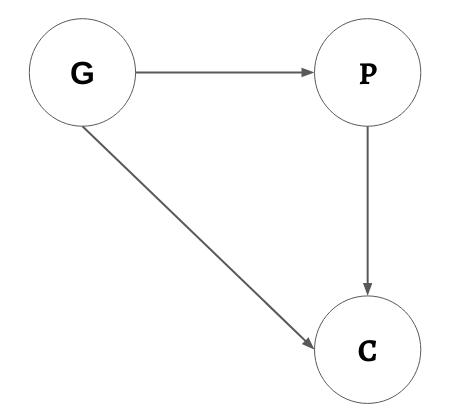
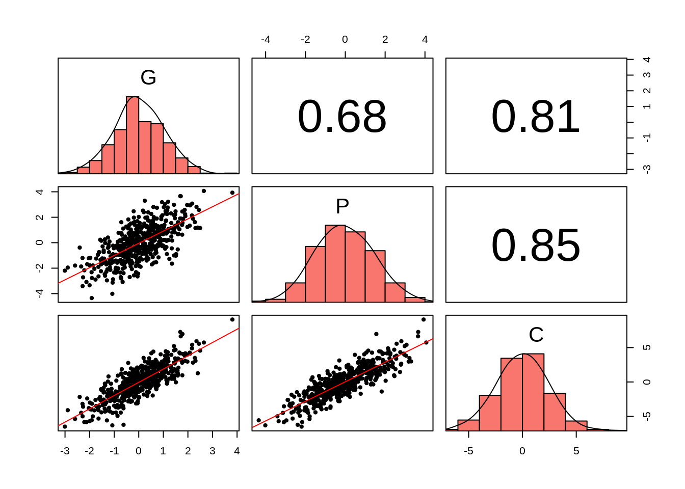
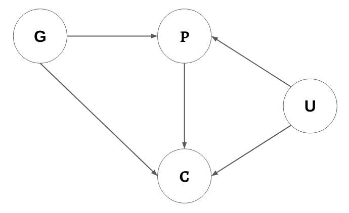

```{r setup, include=FALSE}
knitr::opts_chunk$set(echo = TRUE,comment = '#>',error=TRUE, results = 'hold', out.width='70%')
```

基本題 (共 90 分)
=====================

常態分配檢驗函數 (50 分)
-------------------------

請撰寫一個函數 `checkNormality()` 用來檢視輸入的 vector (`x`) 趨近常態分配的程度。`checkNormality()` 達成此目的的方式是將傳入的資料繪製成直方圖，再於直方圖之上疊加常態分配的機率密度函數曲線。

要求:

- 繪製直方圖時，需依據傳入的 vector `x` 長度自動調整長條的數量
  (可透過 `geom_histogram()` 的參數 `bins` 
  進行設置。請自行實驗找出適合的方式去自動調整 `bins` 
  的數量，讓繪製出來的直方圖盡量平滑沒有斷裂[^smooth])
- 請使用 `geom_point()` 繪製常態分配機率密度之曲線。常態分配的參數依據傳入的 `x` 之平均與標準差決定。

[^smooth]: 假定 vector `x` 是來自連續型機率分配如常態分配、均等分配等。

```{r, fig.show='hold', out.width="32%"}
library(ggplot2)

checkNormality <- function(x) {
  #### Finish this function (you can use the template below) ####
  bins <- length(x)  # 自動依據 x 計算長條數量
    
  plt <- ggplot() +
    geom_histogram(bins = bins) +  # 實際資料之直方圖
    geom_point()                   # 常態分配曲線
  return(plt)
}

###### Do not modify the code below ########
set.seed(1914)
d <- rnorm(200)
checkNormality(d)
d <- rnorm(1000)
checkNormality(d)
d <- runif(1000)
checkNormality(d)
```

Should print out something like：

{width="32%"}
{width="32%"}
{width="32%"}


因果結構模擬 (30 分)
---------------------

{.third}

請根據上圖的因果結構 (箭號代表因果關係) 模擬出 G, P, C 這三個變項的資料，並將結果儲存成一個 data frame `df1`：

- 請模擬出 500 筆觀察值
- 假定 G, P, C 皆來自常態分配
  - G 來自標準常態分配 (平均 = 0, 標準差 = 1)
  - P 與 C 皆來自標準差 = 1 的常態分配
- 假定「G 對 P」、「G 對 C」以及「P 對 C」的因果影響強度是相同的，且影響皆為正向的 (**增加** P 會造成 C 跟著**增加**，而非減少。其它組合亦然)。

```{r}
set.seed(1)
###### Do not modify the code above #######
# Write your code here

###### Do not modify the code below ######
head(df1)
# Should print out:
#>            G          P           C
#> 1 -0.6264538 -0.5491507 -0.04063941
#> 2  0.1836433 -0.1132253  1.18234985
#> 3 -0.8356286 -2.0188709 -3.72527710
#> 4  1.5952808  1.6065735  3.41258588
#> 5  0.3295078  1.3211088  1.72001223
#> 6 -0.8204684  0.7734991 -1.70961817
```


兩兩散布圖 (10 分)
---------------------

請使用上一題的 `df1` 繪製出此圖：

{.half}

```{r}
# Write your code here
```


進階選答題 (共 30 分)
=====================

{.half}


因果結構分析 (10 分)
---------------------

上方的因果結構中，G, P, U, C 可以被歸類成三種因子：混淆因子 (Confounder)、對撞因子 (Collider) 與中介因子 (Mediator)

請將 G, P, U, C 這四個因子進行分類 (請在正確的類別填入 G, P, U, C)：

- Confounder: {write your answer here (separated with comma)}
- Collider: {write your answer here (separated with comma)}
- Mediator: {write your answer here (separated with comma)}


因果結構模擬 (20 分)
---------------------

請根據上圖的因果結構模擬出 G, P, U, C 這四個變項的資料，並將結果儲存成一個 data frame `df2`：

- 請模擬出 500 筆觀察值
- 假定 G, P, U, C 皆來自常態分配
  - G 與 U 來自標準常態分配 (平均 = 0, 標準差 = 1)
  - P 與 C 來自標準差 = 1 的常態分配
- 所有的因果影響皆是正向的 (**增加** P 會造成 C 跟著**增加**，而非減少。其它組合亦然)，但每組因果關係的影響強度不一定相同：
  - G 對 P 的影響強度 (係數) 為 `2`
  - U 對 P 的影響強度 (係數) 為 `1`
  - G 對 C 的影響強度 (係數) 為 `0.5`
  - P 對 C 的影響強度 (係數) 為 `2`
  - U 對 C 的影響強度 (係數) 為 `1`

```{r}
set.seed(1)
###### Do not modify the code above #######
# Write your code here

###### Do not modify the code below ######
head(df2)
# Should print out:
#>            G           P           U          C
#> 1 -0.6264538 -0.04063941  0.07730312  0.5328409
#> 2  0.1836433  1.18234985 -0.29686864  1.2343397
#> 3 -0.8356286 -3.72527710 -1.18324224 -8.1580295
#> 4  1.5952808  3.41258588  0.01129269  6.6930951
#> 5  0.3295078  1.72001223  0.99160104  5.1353315
#> 6 -0.8204684 -1.70961817  1.59396745 -2.4174775
```
